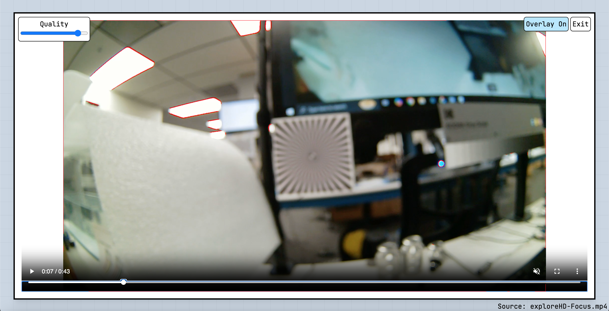
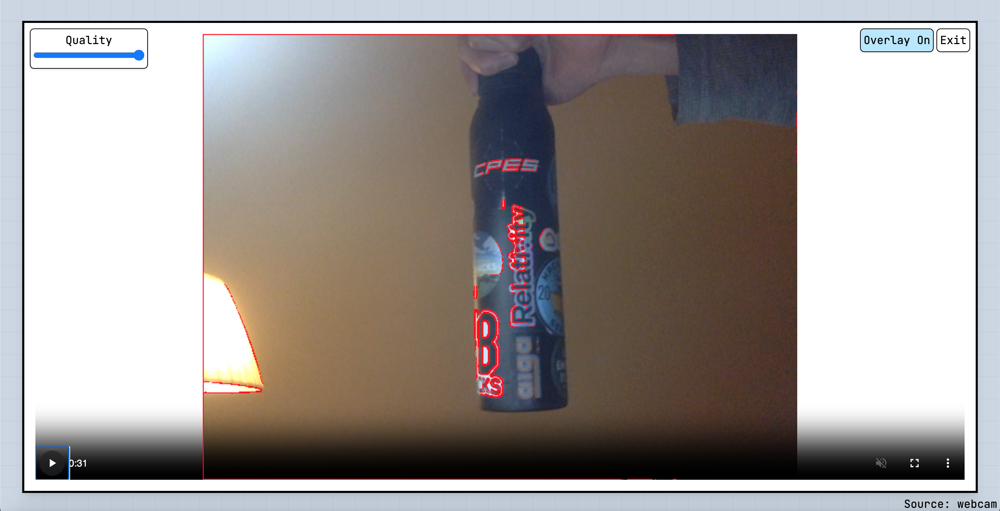

# DWE Take Home

This is my submission for the DWE take-home project. It meets all the functional requirements, plus webcam support, plus a slider to adjust the resolution/quality of the focus peaking overlay.

My approach was pretty straightforward: make a Vite + React app, build it, then make a simple Electron app to display the output as a desktop app. The focus peaking overlay is just Sobel edge detection, displayed on a canvas overlayed on top of the video player element. This makes it super easy to toggle the visibility of the overlay, plus I get to use the native video player controls. Sobel edge detection was still relatively slow at the full 1920 x 1080 pixels, so I added the slider to change the degree to which the input frames are downscaled before edge detection.

There is no Python backend; everything was done using React and javascript. I originally considered having a Flask backend run the edge detection on the entire video first, then send all the overlay data to the frontend to be displayed. While this would have made for a smoother viewing experience, I wanted to try to do everything in real time like an actual camera would. I implemented the Sobel edge detection using Tensorflow.js since all of the other image manipulation libraries were way too slow. It _should_ be able to utilize the GPU, if your machine has one.

## Instructions

1. Run `install.sh` to install all npm packages.
2. Run `run.sh` to build and run the Electron app.

- If step 2 doesn't work, try running `npm run dev` in the `app` directory to start the Electron app in dev mode.
  - If that doesn't work either, run `npm run dev` in the `frontend` directory to start the React app, which you can visit using the browser.

## Screenshots

_Focus peaking overlay is on_

_Focus peaking overlay is off_

_Frame containing objects out of focus_

_Webcam input_
